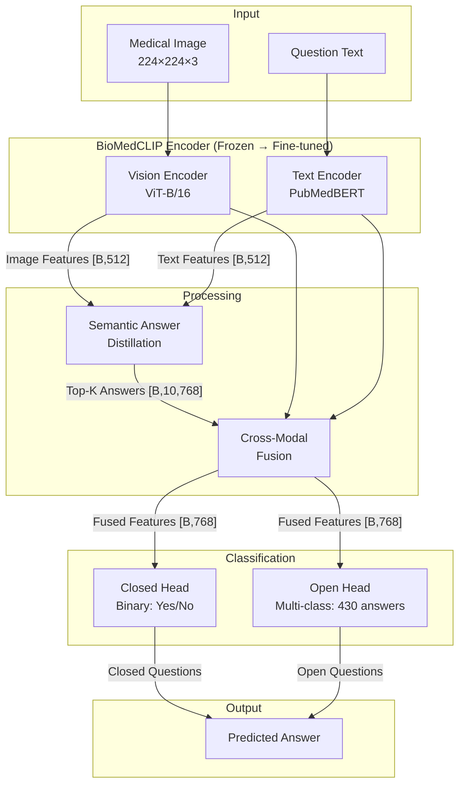
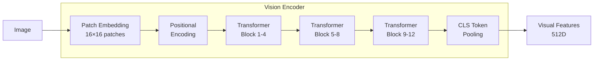
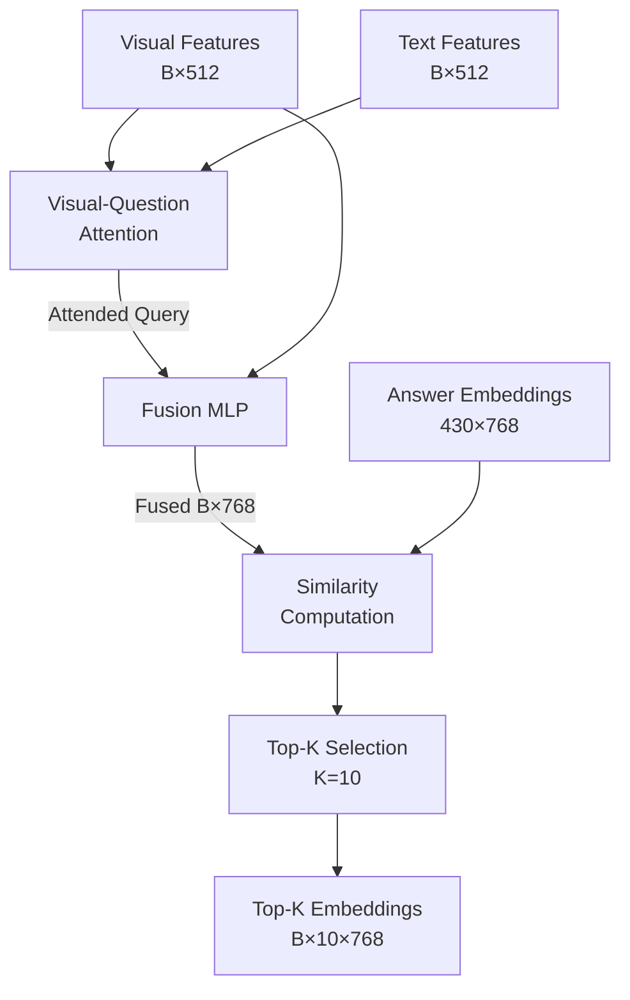
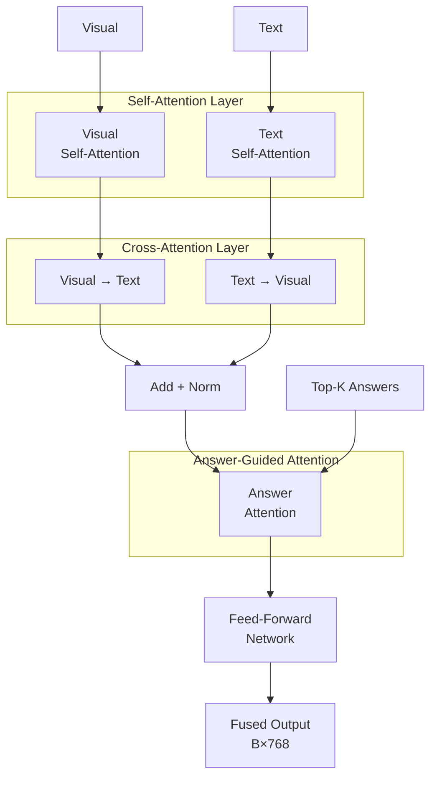
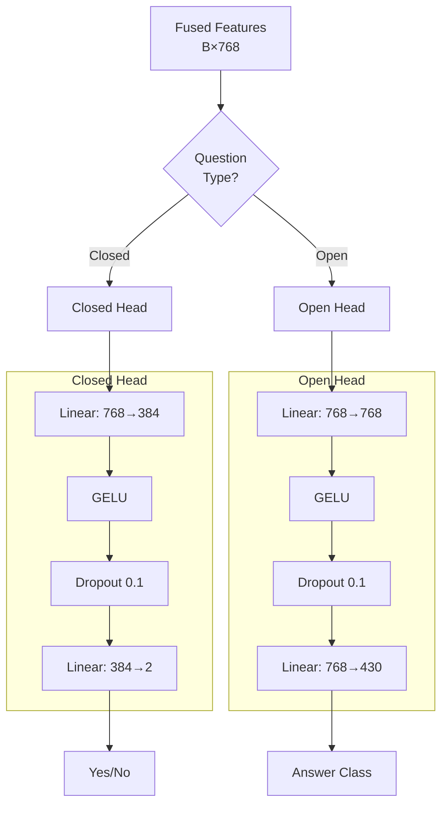
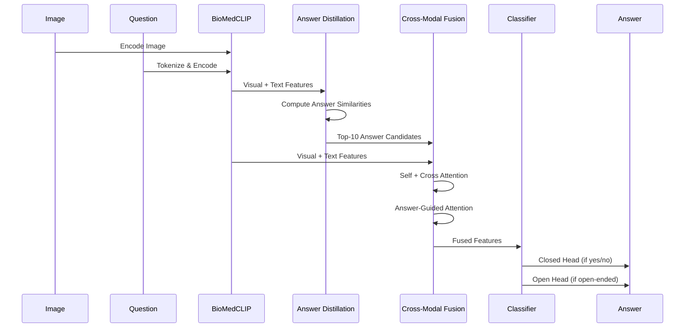
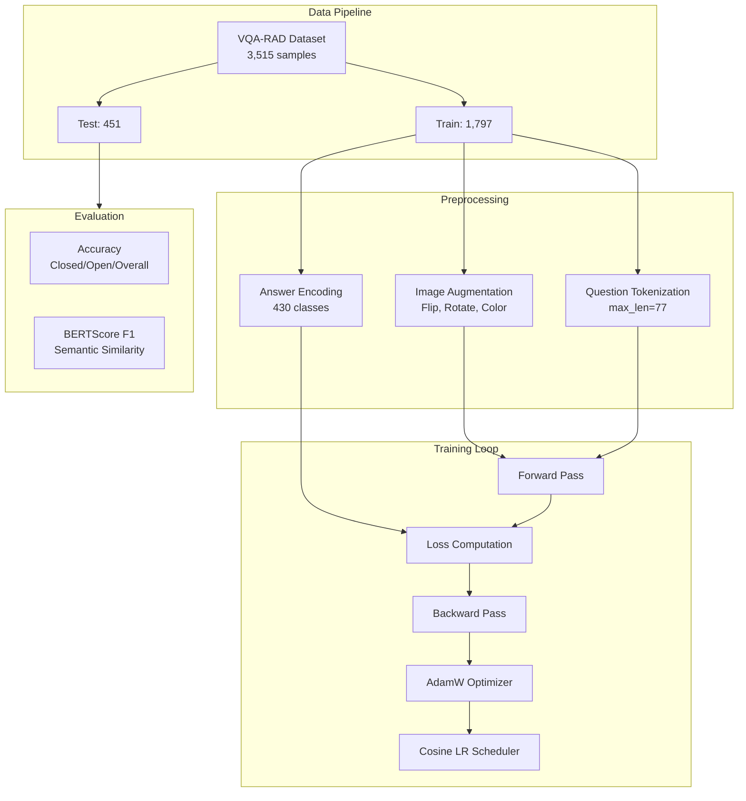

# Enhanced BTIA-AD Net: Architecture Report

## Executive Summary

Enhanced BTIA-AD Net (Bimodal Transformer for Image Answering with Answer Distillation) is a Medical Visual Question Answering (VQA) system designed for answering clinical questions about medical images. The system leverages **BioMedCLIP** (a domain-specific vision-language model) with custom fusion and classification components.

---

## System Architecture Overview



---

## Component Details

### 1. BioMedCLIP Encoder

**Purpose**: Extract domain-specific visual and textual representations from medical images and clinical questions.

| Component | Architecture | Output Dimension |
|-----------|--------------|------------------|
| Vision Encoder | ViT-B/16 (PubMed pre-trained) | 512 |
| Text Encoder | PubMedBERT | 512 |
| Image Size | 224 × 224 | - |
| Max Question Length | 77 tokens | - |



**Key Features**:
- Pre-trained on PubMed image-text pairs
- Multi-scale feature extraction (blocks 3, 6, 9, 11)
- Progressive unfreezing during training

---

### 2. Semantic Answer Distillation Network

**Purpose**: Select top-K most relevant answer candidates based on visual-question context.



**Parameters**:
| Parameter | Value | Description |
|-----------|-------|-------------|
| K (Top-K) | 10 | Number of answer candidates |
| Hidden Dim | 768 | Internal feature dimension |
| Attention Heads | 8 | Multi-head attention |

---

### 3. Cross-Modal Fusion Module

**Purpose**: Deep bi-directional fusion of visual, textual, and answer candidate features.



**Architecture**:
- 8 attention heads
- 2 fusion layers
- FFN expansion ratio: 4×
- Dropout: 0.1

---

### 4. Dual Classification Heads

**Purpose**: Separate specialized classifiers for closed (yes/no) and open (multi-class) questions.



---

## Data Flow



---

## Training Pipeline



---

## Loss Function

**Simple Dual-Head Loss with Label Smoothing**:

$$\mathcal{L}_{total} = w_{closed} \cdot \mathcal{L}_{CE}^{closed} + w_{open} \cdot \mathcal{L}_{CE}^{open}$$

| Component | Formula | Weight |
|-----------|---------|--------|
| Closed Loss | CrossEntropy (smoothing=0.05) | 1.0 |
| Open Loss | CrossEntropy (smoothing=0.1) | 1.5 |

---

## Training Configuration

| Parameter | Value | Description |
|-----------|-------|-------------|
| Batch Size | 16 | Samples per batch |
| Learning Rate | 2e-5 | Initial learning rate |
| Optimizer | AdamW | Weight decay = 0.01 |
| Scheduler | Cosine Annealing | η_min = 1e-7 |
| Epochs | 50 | Maximum training epochs |
| Mixed Precision | FP16 | AMP enabled |

### Progressive Unfreezing Schedule

| Epoch | Action |
|-------|--------|
| 0-2 | All encoders frozen |
| 3+ | Unfreeze text encoder |
| 8+ | Unfreeze last 2 vision blocks |

---

## Model Parameters

| Module | Parameters | Trainable (Initial) |
|--------|------------|---------------------|
| BioMedCLIP Encoder | ~150M | Frozen |
| Answer Distillation | ~5M | Yes |
| Cross-Modal Fusion | ~12M | Yes |
| Classification Heads | ~1M | Yes |
| **Total** | **~168M** | **~18M** |

---

## Evaluation Metrics

| Metric | Target | Description |
|--------|--------|-------------|
| Closed Accuracy | 80% | Yes/No questions |
| Open Accuracy | 60% | Multi-class questions |
| Overall Accuracy | 70% | Combined |
| BERTScore F1 | 0.75+ | Semantic similarity |

---

## File Structure

```
imp2/
├── config.py          # Configuration dataclasses
├── dataset.py         # VQA-RAD data loading
├── model.py           # Neural network architecture
├── train.py           # Training loop (v5)
├── requirements.txt   # Dependencies
├── data/
│   └── vqa_rad/       # Dataset files
├── checkpoints/       # Model weights
│   ├── best_closed.pth
│   ├── best_open.pth
│   └── best_overall.pth
└── logs/              # Training logs
    └── training_v5_*.log
```

---

## References

1. **BioMedCLIP**: Microsoft's biomedical vision-language model pre-trained on PubMed
2. **VQA-RAD**: Radiology-specific VQA dataset (Lau et al., 2018)
3. **BTIA-AD Net**: Original architecture paper (reference implementation)
