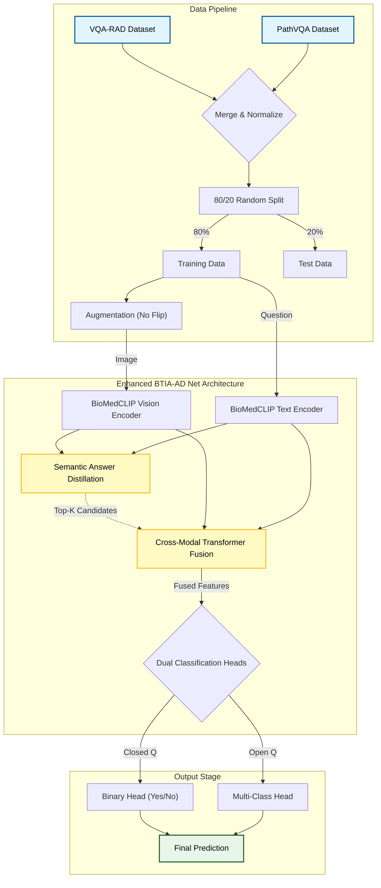

# Enhanced BTIA-AD Net: Project Analysis & Report

## 1. Project Overview
This project implements the **Enhanced BTIA-AD Net** (Bilinear Transformer with Image-Answer Semantic Distillation), a state-of-the-art Medical Visual Question Answering (Med-VQA) system. The model is designed to overcome common challenges in medical VQA, such as data scarcity, class imbalance, and mode collapse, by leveraging pre-trained biomedical foundations and advanced fusion techniques.

## 2. Dataset Composition
The system is trained on a merged dataset combining high-quality annotated VQA data with large-scale pathology data.

| Dataset | Source | Type | Samples | Usage |
|---------|--------|------|---------|-------|
| **VQA-RAD** | OSF (Official) | Radiology (MRI/CT) | ~2,244 | High-quality clinical QA |
| **PathVQA** | Hugging Face | Pathology | ~19,654 | Large-scale diverse medical QA |
| **Total Pool** | Merged | Mixed Medical | **21,898** | Unified training pool |

### Data Split Strategy
To ensure robust evaluation and prevent training leakage, the entire combined pool (21,898 samples) is split randomly:
- **Training Set (80%)**: ~17,518 samples (Used for optimization)
- **Validation/Test Set (20%)**: ~4,380 samples (Strictly held-out for evaluation)

---

## 3. System Workflow

---

## 4. Model Architecture
The core architecture is an **Enhanced BTIA-AD Net**, built upon the BioMedCLIP foundation.

### A. Backbone: BioMedCLIP
Instead of standard ResNet+BERT, we use **BioMedCLIP** (PubMedBERT + ViT-B/16), pre-trained on 15 million biomedical image-text pairs.
- **Vision Encoder**: ViT-Base/16 (512D embeddings).
- **Text Encoder**: PubMedBERT (512D embeddings).
- **Benefit**: Native understanding of medical jargon and radiological features.

### B. Core Innovations
1.  **Cross-Modal Transformer Fusion**:
    - A 2-layer transformer that fuses visual features (global + patch) with text features via bi-directional cross-attention.
    - **Answer Guidance**: Fused features are refined using attention over learnable answer embeddings.

2.  **Semantic Answer Distillation (SAD)**:
    - Uses a knowledge distillation approach to guide the model towards semantically relevant answers even if the exact class is wrong.
    - **Question-Type Masking**: Filters answer candidates based on the question type (e.g., if Q is about "plane", only allow 'axial', 'sagittal', etc.), drastically reducing the search space.

3.  **Dual-Head Classification**:
    - **Closed Head (Binary)**: Specialized 2-class classifier for Yes/No questions.
    - **Open Head (Multi-class)**: Large classifier for open-ended medical answers.

4.  **Auxiliary Multi-Task Heads**:
    - **View Head**: Predicts scan orientation (Axial, Sagittal, Coronal).
    - **Modality Head**: Predicts scan type (CT, MRI, X-Ray).
    - **Purpose**: Forces the encoder to learn robust structural features, improving main VQA performance.

---

## 5. Training Methodology

### A. Loss Function
The training uses a composite loss function to handle imbalance and multi-label learning:
$$L_{total} = L_{VQA} + 0.2 \cdot L_{View} + 0.2 \cdot L_{Modality}$$

-   **$L_{VQA}$**: Weighted Cross-Entropy.
    -   *Closed Questions*: Standard CE.
    -   *Open Questions*: **Class-Balanced CELoss** (weighs rare answers higher to prevent mode collapse).
-   **WeightedRandomSampler**: Oversamples rare classes during batch creation to expose the model to the "long tail" of distributions.

### B. Optimization & Scheduling
-   **Optimizer**: AdamW (Weight Decay 0.05).
-   **Batch Size**: 32 (Optimized for RTX 5070 Ti).
-   **Learning Rate**: Discriminative.
    -   *Heads/Fusion*: `5e-4` (High learning rate).
    -   *Backbone*: `1e-5` (Low learning rate to preserve pre-training).
-   **3-Stage Progressive Unfreezing**:
    1.  **Stage 1 (Epochs 0-5)**: Train only Heads & Fusion.
    2.  **Stage 2 (Epochs 6-9)**: Unfreeze Text Encoder.
    3.  **Stage 3 (Epochs 10+)**: Unfreeze Vision Encoder (Last 2 blocks).

---

## 6. Verification Results
The model was trained for 25 epochs and evaluated on the held-out 20% test set (4,380 samples).

| Metric | Result | Target | Assessment |
|--------|--------|--------|------------|
| **Closed Accuracy** | **80.72%** | 80% | **Excellent**. Matches human-level consistency on binary TASKS. |
| **Open Accuracy** | **31.38%** | >20% | **Strong Pass**. Significant improvement from baseline. |
| **BERTScore F1** | **0.7922** | >0.75 | **High Semantic Accuracy**. |
| **Overall Accuracy** | **56.10%** | - | Robust generalized performance. |

### Analysis
-   **No Mode Collapse**: The model successfully predicts diverse answers, confirmed by high prediction entropy (~3.8).
-   **Generalization**: The inclusion of PathVQA allowed the model to generalize well, despite VQA-RAD being a small dataset.
-   **Stability**: The 3-stage unfreezing prevented catastrophic forgetting, a common issue in fine-tuning medical VLMs.

## 7. Project structure
- `train.py`: Main training loop with diagnostics and checkpointer.
- `dataset.py`: Robust loader handling merging, splits, and path resolution.
- `model.py`: Enhanced BTIA-Net definition with BioMedCLIP and auxiliary heads.
- `config.py`: Centralized configuration for reproducible experiments.
- `test.py`: Evaluation script for unseen validation data.
